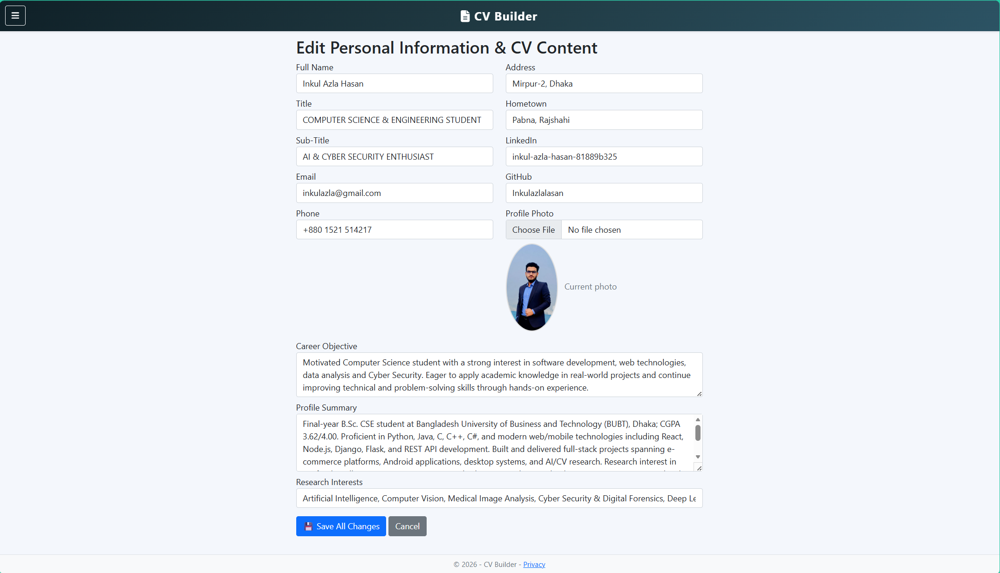
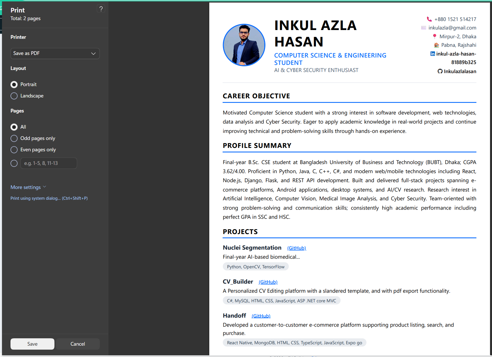
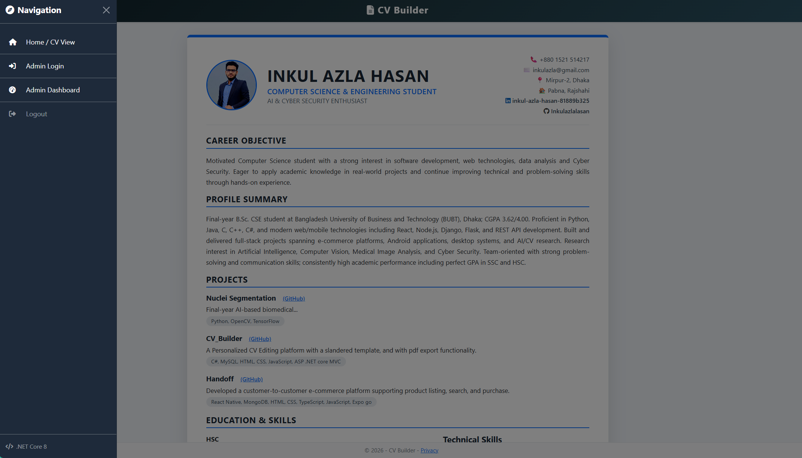

# CV Builder - Dynamic Portfolio & CV Manager

A fully functional ASP.NET Core MVC web application that allows users to manage their CV dynamically. Built for a .NET Developer Internship application.

## 🚀 Features
- **Full CRUD** for Projects, Education, Skills, and Personal Info.
- **Admin Dashboard** with secure login.
- **Real-time CV Preview** (changes reflect instantly).
- **Export to PDF** with optimized A4 formatting.
- **Sortable Items** (Display Order for projects & education).
- **Profile Photo Upload**.

---

## 📸 Screenshots

### 🏠 Public CV View (Home page)

### 🛠️ Admin Dashboard (Manage Projects, Education, Skills)

### ✏️ Edit CV Content & Profile

### ✏️ Save PDF of CV

### ✏️ Side Navigation Bar for Admin

---

## 🛠️ Tech Stack
- **Backend**: ASP.NET Core 8.0 MVC, Entity Framework Core
- **Database**: SQL Server LocalDB
- **Frontend**: Bootstrap 5, Font Awesome, Razor Views
- **Version Control**: Git & GitHub